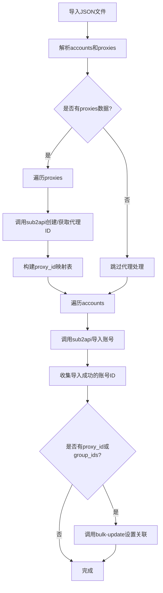

# 导入功能增强方案 - 支持分组和代理关联

## 问题背景

从外部系统导入账号后，后台账号列表没有"分组"和"代理"信息。根因是导入链路从输入到存储全链路未实现 group/proxy 关联语义。

## 目标

实现导入时自动处理分组和代理关联，确保导入后的账号能正确显示分组和代理信息。

## 技术方案

### 方案概述

在 `upload_to_sub2api()` 函数中增加以下逻辑：

1. **代理处理**：解析 `proxy_key`，在 sub2api 中查找或创建对应代理
2. **分组处理**：支持配置默认分组，或从导入数据中读取分组信息
3. **关联更新**：导入账号后，调用 `bulk-update` 接口设置关联

### 数据流程图



### 详细设计

#### 1. 新增配置项

在 Settings 页面增加以下配置：

| 配置键 | 说明 | 示例值 |
|--------|------|--------|
| `sub2api_default_group_id` | 默认分组ID | `1` |
| `sub2api_default_group_ids` | 默认分组ID列表（多分组） | `[1, 2]` |
| `sub2api_auto_create_proxy` | 是否自动创建代理 | `true` |

#### 2. 新增函数

##### 2.1 `ensure_sub2api_proxy()`

确保代理存在于 sub2api，返回 proxy_id。

```python
def ensure_sub2api_proxy(
    proxy_key: str,
    api_url: str,
    api_key: str,
) -> Tuple[Optional[int], str]:
    """
    确保 proxy 存在于 sub2api，返回 proxy_id。
    
    Args:
        proxy_key: 代理标识，格式为 "protocol|host|port||"
        api_url: sub2api 地址
        api_key: API 密钥
        
    Returns:
        (proxy_id, error_message)
    """
    # 1. 解析 proxy_key
    # 2. 查询 sub2api 是否已有该代理
    # 3. 若无则创建
    # 4. 返回 proxy_id
```

##### 2.2 `bulk_update_sub2api_accounts()`

批量更新账号的分组和代理关联。

```python
def bulk_update_sub2api_accounts(
    account_ids: list[int],
    api_url: str,
    api_key: str,
    proxy_id: Optional[int] = None,
    group_ids: Optional[list[int]] = None,
) -> Tuple[bool, str]:
    """
    批量更新账号的代理和分组关联。
    
    Args:
        account_ids: 账号ID列表
        api_url: sub2api 地址
        api_key: API 密钥
        proxy_id: 代理ID
        group_ids: 分组ID列表
        
    Returns:
        (success, message)
    """
```

##### 2.3 `search_sub2api_account()`

搜索账号获取ID。

```python
def search_sub2api_account(
    name: str,
    api_url: str,
    api_key: str,
) -> Tuple[Optional[int], str]:
    """
    通过账号名搜索账号ID。
    
    Args:
        name: 账号名（邮箱@前面的部分）
        api_url: sub2api 地址
        api_key: API 密钥
        
    Returns:
        (account_id, error_message)
    """
```

#### 3. 修改 `upload_to_sub2api()`

在现有导入逻辑后增加关联处理：

```python
def upload_to_sub2api(
    account,
    api_url: str = None,
    api_key: str = None,
    import_path: str = None,
    proxy_url: str = "",
    skip_default_group_bind: Any = None,
    # 新增参数
    proxy_id: Optional[int] = None,
    group_ids: Optional[list[int]] = None,
    auto_create_proxy: bool = True,
) -> Tuple[bool, str]:
    """上传单账号到 sub2api，并设置代理和分组关联。"""
    
    # ... 现有导入逻辑 ...
    
    # 新增：导入成功后设置关联
    if success:
        # 1. 如果有 proxy_key 但无 proxy_id，尝试创建代理
        if not proxy_id and proxy_url and auto_create_proxy:
            proxy_key = _build_proxy_key(proxy_url)
            proxy_id, _ = ensure_sub2api_proxy(proxy_key, api_url, api_key)
        
        # 2. 获取刚导入的账号ID
        account_name = account.email.split("@")[0]
        account_id, _ = search_sub2api_account(account_name, api_url, api_key)
        
        # 3. 批量更新关联
        if account_id and (proxy_id or group_ids):
            bulk_update_sub2api_accounts(
                [account_id], api_url, api_key, proxy_id, group_ids
            )
    
    return success, message
```

#### 4. 修改 `generate_sub2api_export()`

确保导出的 JSON 包含正确的 proxy_key 格式。

#### 5. 前端修改

##### 5.1 Settings 页面

增加分组配置：

```tsx
// frontend/src/pages/Settings.tsx
{
  key: 'sub2api',
  title: 'sub2api',
  desc: '注册完成后自动导入到 sub2api 管理后台',
  fields: [
    // ... 现有字段 ...
    { key: 'sub2api_default_group_ids', label: '默认分组ID', placeholder: '多个用逗号分隔，如: 1,2' },
    { key: 'sub2api_auto_create_proxy', label: '自动创建代理', placeholder: 'true / false' },
  ],
}
```

##### 5.2 Accounts 页面

导入弹窗增加分组选择：

```tsx
// frontend/src/pages/Accounts.tsx
// 导入弹窗增加分组和代理选择
<Form.Item name="group_ids" label="分组">
  <Select mode="multiple" placeholder="选择分组">
    {/* 从 sub2api 获取分组列表 */}
  </Select>
</Form.Item>
```

### API 接口说明

#### sub2api 相关接口

| 接口 | 方法 | 说明 |
|------|------|------|
| `/api/v1/admin/accounts` | GET | 搜索账号 |
| `/api/v1/admin/accounts/bulk-update` | POST | 批量更新账号 |
| `/api/v1/admin/proxies` | GET | 获取代理列表 |
| `/api/v1/admin/proxies` | POST | 创建代理 |
| `/api/v1/admin/groups` | GET | 获取分组列表 |

### 实现步骤

#### Phase 1: 核心功能（最小可行）

1. 在 `cpa_upload.py` 中实现 `ensure_sub2api_proxy()`
2. 在 `cpa_upload.py` 中实现 `search_sub2api_account()`
3. 在 `cpa_upload.py` 中实现 `bulk_update_sub2api_accounts()`
4. 修改 `upload_to_sub2api()` 集成上述函数
5. 增加配置项支持

#### Phase 2: 前端增强

1. Settings 页面增加分组配置
2. 导入弹窗增加分组选择（可选）

#### Phase 3: 批量导入优化

1. 支持从 JSON 文件批量导入
2. 自动处理 proxies 数组
3. 批量设置关联

### 文件修改清单

| 文件 | 修改内容 |
|------|----------|
| `platforms/chatgpt/cpa_upload.py` | 新增3个函数，修改 `upload_to_sub2api()` |
| `api/config.py` | 新增配置键 |
| `frontend/src/pages/Settings.tsx` | 增加分组配置UI |
| `frontend/src/pages/Accounts.tsx` | 导入弹窗增加分组选择（可选） |

### 测试用例

1. 导入单个账号，自动创建代理并关联
2. 导入单个账号，关联到指定分组
3. 导入单个账号，同时设置代理和分组
4. 批量导入多个账号，统一设置分组
5. 从 JSON 文件导入，自动处理 proxies 数组

### 风险与注意事项

1. **API 兼容性**：需确认 sub2api 的代理创建接口格式
2. **幂等性**：重复导入同一账号时，应更新而非重复创建
3. **错误处理**：代理/分组设置失败时，账号已导入，需记录日志
4. **性能**：批量导入时，应合并 bulk-update 请求

---

## 下一步

确认方案后，切换到 Code 模式实现。
